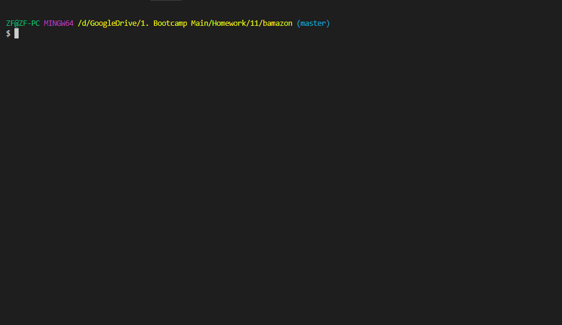

# bamazon

## Overview
The app is an Amazon-like store-front using MySQL and Node.js. The app takes in orders from customers, depletes stock, and gives a total price. In the manager script, users can add inventory and add new products.
 
The data is printed in the console using inquirer. 

## Instructions
To run this:
You will need to install node.js to your computer.
 
Install the required packages.
 
An env is required to store the password to MySQL.
### To Use
Type in node bamazonCustomer.js or bamazonManager.js in your terminal (make sure the current directory is the bamazon-app folder)
 
Select your desired command in the console.
## Demonstration

### Customer

 
  * Does the following.
    * Shows all products.
    * Allows user to purchase product. Checks quantity of item and tells user whether it is in stock. Gives price at end of order.

### Manager
  * Does the following.
####  Shows all products.
    
#### Allows user to view low inventory items.
    
#### Allows user to add inventory.
    
#### Allows user to add a new product.
    

## Built With
* node.js
* JavaScript
* [inquirer from npm](https://www.npmjs.com/package/inquirer)-for interface in console
* [MySQL](https://www.mysql.com/) - For database
* [MySQL](https://www.npmjs.com/package/mysql) - For database use in JavaScript
* [dotenv](https://www.npmjs.com/package/dotenv) - For hiding API key

## Author
* Kayleigh Starr